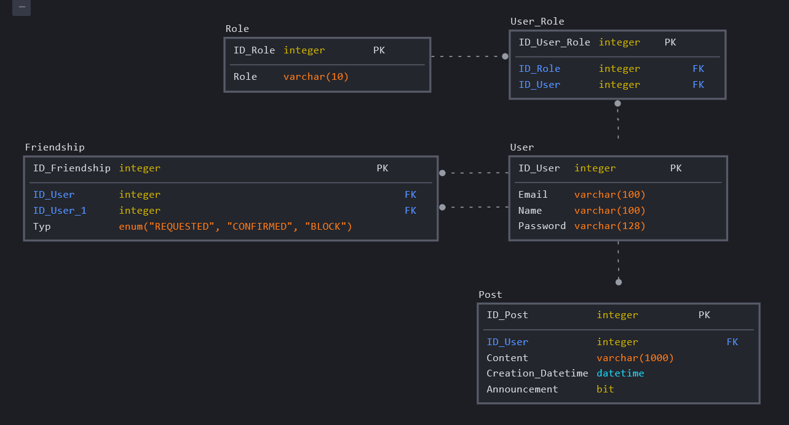
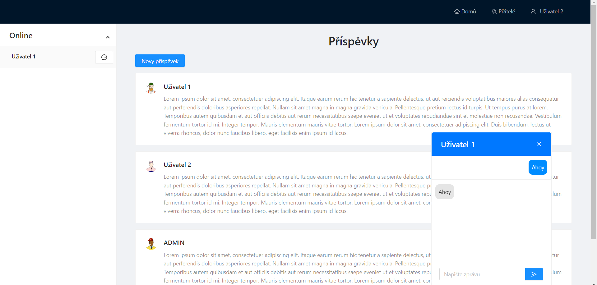
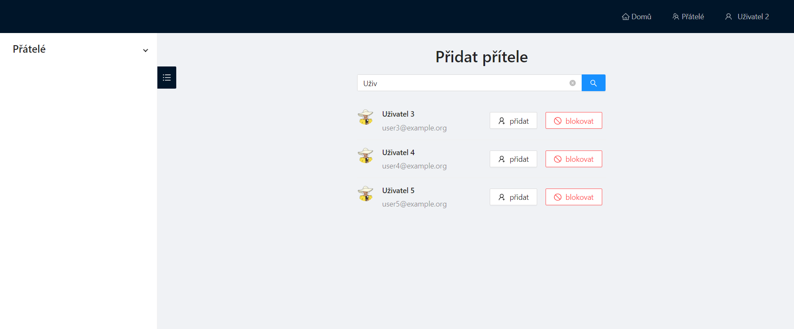
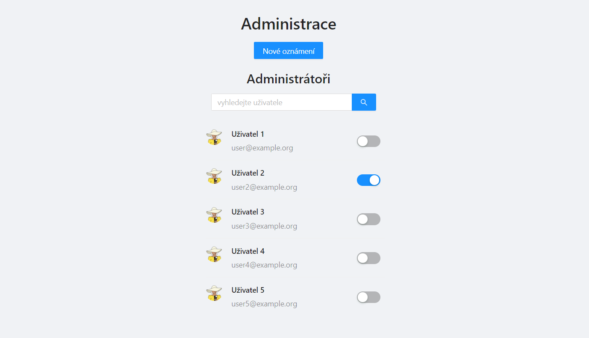

# PostNet
Semestrální práce z předmětu PIA

## Zadání
Vytvořit jednoduchou sociální síť. Tato sociální síť bude umožňovat přihlášení pomocí zaregistrovaného emailu a hesla. Dále bude možnost registrovat nové uživatele. Po přihlášení bude mít uživatel možnost psát příspěvky, spravovat své přátele a chatovat s nimi. Dále bude moci uživatel získat roli administrátora, která mu umožní přidávat/odebírat administrátorské role jiným uživatelům. Administrátor bude moci zveřejňovat oznámení - příspěvky, které se zobrazují všem.

## Zvolená bonusová rozšíření
* použití OpenAPI a React
* výpočet síly hesla při registraci
* možnost zobrazení starších příspěvků

## Použité technologie
### Serverová část
* Java 11
* Maven
* Spring Boot
* Spring Websockets
* JPA Hibernate ORM
* MySQL
* Liquibase

### Klientská část
* Node.js
* Next.js
* React
* Typescript
* Ant Design

## Sestavení a spuštění aplikace
* vyklonovat repozitář pomocí `git clone https://github.com/hrubyj/postnet.git`
* v kořenovém adresáři spustit:
  * `docker-compose build` (sestavení)
  * `docker-compose up` (spuštení)

## Popis implementace
### Model

### Server
Serverová část je členěna do adresářů:
* `config` - konfigurace zabezpečení a websocketů
* `controller` - controllery implementující generované rozhraní klient-server
* `domain` - doménové objekty
* `repository` - repozitáře pracující s doménovými objekty
* `service` - třídy obsluhující logiku
* `start` - hlavní spustitelná třída
* `vo` - přepravky

Rozhraní klient-server je nadefinováno v souboru `api.yml`. V tomto souboru jsou definována rozhraní jednotlivých controllerů. Pomocí maven pluginu je pak rozhraní vygenerováno. Vygenerované rozhraní je implementováno třídami v adresáři `controller`. Každá z těchto tříd využívá třídy logické vrstvy (adresář `service`), které provedou danou operaci.

Autentizace je implementována s pomocí JsonWebToken. Pokud jsou při přihlašování údaje korektní, server vygeneruje autentizační token, který se následně bude posílat s každým dalším požadavkem pro ověřování identity uživatele. 

Při startu serveru se kontroluje existence administrátora. Pokud žádný administrátor neexistuje, je vytvořen nový - `admin@example.org` : `adminpassword`.

### Klient
Klientská část je členěna do adresářů:
* `components`
* `hooks`  
* `pages` 
* `public`
* `vos`

Klientská část po spuštění běží na portu `3000` a má bez autentizace přístupné body `/`, `/login` a `/register`. Tyto body slouží k registraci nebo příhlášení uživatele. Po přihlášení je uživatel přesměrován na pohled `/posts`, kde se mu zobrazují příspěvky zvěřejněné jeho přáteli či administrátorská oznámení. Tento pohled doplňuje postranní panel, kde se zobrazují online uživatelé. Ze seznamu online uživatelů lze vybrat pomocí tlačítka přítele pro chatování. Zobrazování aktuálního seznamu online přátel a chatování s nimi je implementováno zkrze webové sokety implementované protokolem STOMP.

Dále je v  každém pohledu přítomno navigační menu. Lze se pomocí něj odhlásit a přepínat mezi pohledy `/posts`, `/friends` nebo `/admin`. 

Pohled `/friends` obsahuje komponenty pro správu přátel. V hlavním panelu se zobrazuje seznam uživatelů, které si uživatel může přidat do přátel nebo zablokovat. Tyto uživatele lze pomocí textového pole pohodlně vyhledávat fulltextově podle jména. Přátele, žádosti o přátelství a blokovaní uživatelé se pak zobrazují v postranním panelu.

Pohled `/admin` obsahuje pohled administrátora. V hlavním panelu lze vytvářet nová oznámení nebo případně spravovat administrátorské role ostatních uživatelů. Uživatele lze vyhledávat pomocí textového pole.

